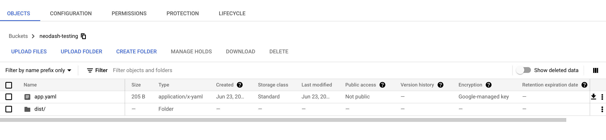

## NeoDash - Neo4j Dashboard Builder

NeoDash is an open source tool for visualizing your Neo4j data. It lets you group visualizations together as dashboards, and allow for interactions between reports.


Neodash supports presenting your data as tables, graphs, bar charts, line charts, maps and more. It contains a Cypher editor to directly write the Cypher queries that populate the reports. You can save dashboards to your database, and share them with others.

I have added the instructions here for both using the dashboard system locally as well as publishing a dashboard with a web server.

## Initial Steps

First clone this repository, cd into the repository, and install the necessary dependencies:

```
git clone git@github.com:DiamondDAO/neodash.git
cd neodash
npm install
```

## Running locally

To run the instance locally, use command `npm run dev`. This will host neodash at `localhost:3000` by default and will allow you to connect to an instance, create dashboards, and save dashboards.

## Publishing a dashboard

After creating a dashboard, you may want to publish this dashboard as a url which can be easily shared. To do this, first ensure that your dashboard has a unique name and is saved to the graph instance.

In your neodash repo, run `npm run build`. This will create a `dist/` folder which has the necessary components to host a dashboard. Locate the `config.json` file and change it to have this structure:

```
{
    "ssoEnabled": false,
    "ssoDiscoveryUrl": "https://example.com/",
    "standalone": true,
    "standaloneProtocol": "neo4j+s",
    "standaloneHost": "URI",
    "standalonePort": "7687",
    "standaloneDatabase": "neo4j",
    "standaloneDashboardName": "DASHBOARD_NAME",
    "standaloneUsername": "USERNAME",
    "standalonePassword": "PASSWORD",
    "standaloneDashboardDatabase": "",
    "standaloneDashboardURL": ""
}
```

Some of these values are fixed, but the password and username need to be set appropriately as well as the connection details (the URI/host without the protocol and the protocol separately). Finally, the standaloneDashboardName should have the name of the saved dashboard in the neo4j instance which you wish to publish.

Navigate to Google Cloud and create a new project (assume name of project is PROJECT_NAME). Additionally create a bucket (assume name of bucket is BUCKET_NAME).

Then, create a `app.yaml` file separately (not inside the `dist/` folder) which looks like this and fill in the proper BUCKET_NAME:

```
runtime: nodejs16

instance_class: F2

env_variables:
  BUCKET_NAME: "BUCKET_NAME"

handlers:
  - url: /
    static_files: dist/index.html
    upload: dist/index.html

  - url: /
    static_dir: dist/
```

Upload the `dist/` folder and `app.yaml` to the bucket which was just created separately, so your bucket looks like:



Open the google cloud shell and connect to the created project. Create a folder for your project: `mkdir my-app` and then run the command `gsutil rsync -r gs://{BUCKET_NAME} ./my-app` and replace the {BUCKET_NAME} with the actual name of the bucket. This will sync the files and copy them to your `my-app` folder. CD into the folder with `cd my-app` and run `gcloud app deploy`. This may prompt you for authorization and to choose a location, but after completion your dashboard should be published.

Run the command `gcloud app browse` to get the url of your hosted dashboard and you should be able to navigate to it and see your work. This hosting also has the added benefit of updating automatically, thus whenever you update the dashboard and re-save it to the neo4j instance, the changes will be reflected in this hosted URL.
